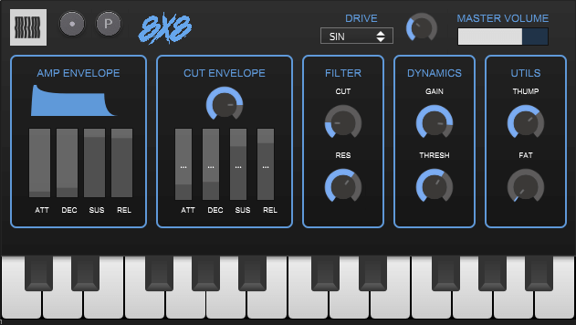
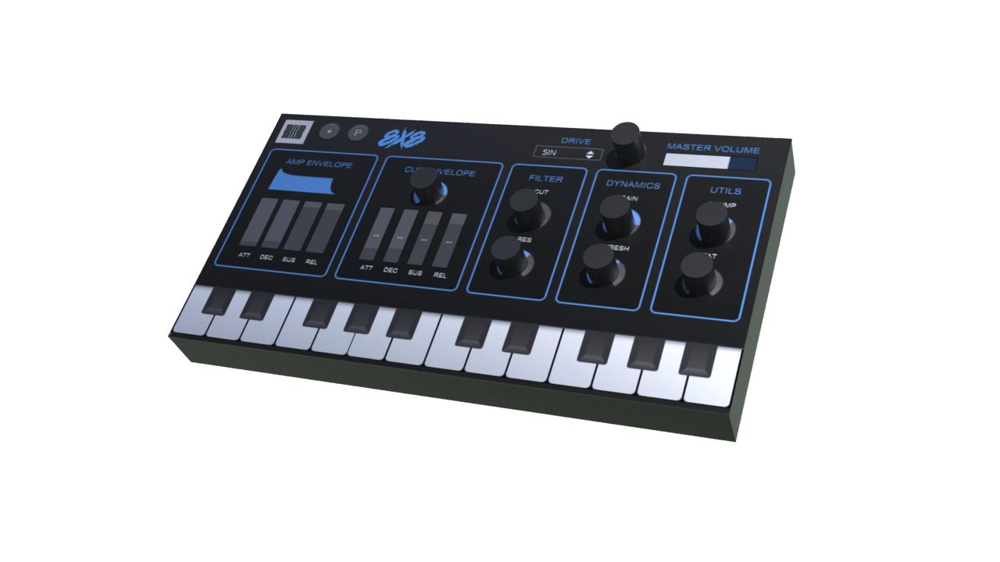

# 8x8
Open source 808 bass VST3 plugin instrument, made with the HISE framework

Interface I designed in figma.
3d mockup I did with Houdini (I Think)
I know verry little about c++ so dont expect any updates or bug fixes atleast for the time being. 
Provided as is under GPLv3 License
